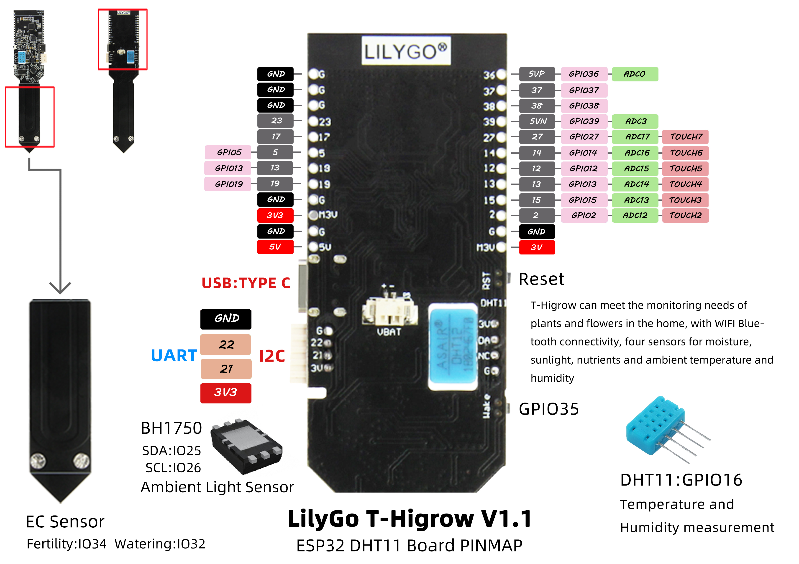
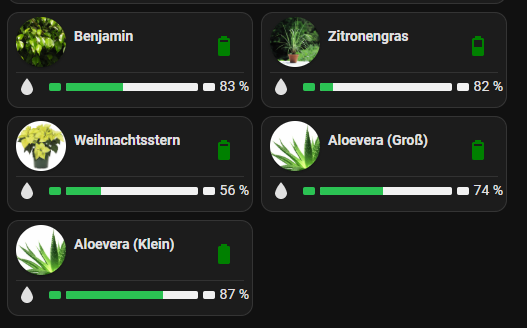
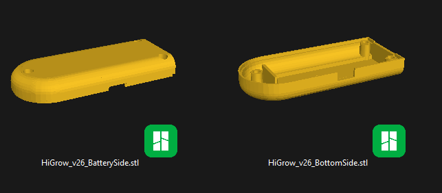

# LilyGO TTGO T-HiGrow
## TTGO T-HIGrow MQTT autodiscover interface for Homeassistant



> **NEW in v5.5.0**: Clock-aligned wake-ups! Sensors now wake on the clock grid — on the full hour with a 1 h sleep interval, on the half hour with 30 min, etc.
>
> **v5.4.0**: Over-the-air (OTA) firmware updates via Home Assistant! After one last USB flash, all sensors update themselves over WiFi — see [OTA Firmware Updates](#ota-firmware-updates).
>
> **v5.0.0**: Native Home Assistant Auto Discovery integration! No more external Python scripts needed.

See [CHANGELOG.md](CHANGELOG.md) for detailed release notes.

### Getting started

Refer to the [Setup & Configuration Guide](howto.md) for comprehensive instructions on installation, configuration, and troubleshooting.

## Disclaimer

The project is forked from [@pesor](https://github.com/pesor) - who did a great work. The original repo is deleted meanwhile.

**Primary modifications are:**

- OTA firmware updates via Home Assistant — no USB cable needed after initial flash
- Updates in MQTT messages to reflect latest Home Assistant changes
- Auto Discovery for Home Assistant
- New Casing (3D print stl files) supporting larger LiPo battery
- Original Casing (3D print stl files)
- Some Bugfixing and optimizations

## OTA Firmware Updates

Since v5.4.0 the sensors update their firmware over WiFi. The firmware is hosted locally on your Home Assistant (`config/www/higrow/`) — no internet hosting, no cloud, no token.

Because the sensors spend almost all their time in deep sleep, updates work on a **pull principle**: on every wake-up (hourly, or every 5 minutes while charging) the sensor checks a small `manifest.json` on Home Assistant right after connecting to WiFi. If the version differs from the running firmware, it streams the new binary into the inactive OTA slot (MD5-verified) and reboots — the new firmware then takes over that measurement cycle immediately. If anything goes wrong (HA unreachable, aborted download, checksum mismatch) the sensor simply continues its normal cycle on the old firmware.

Rolling out a new version is one command:

```
pio run -t ota_deploy
```

This builds the firmware, generates the manifest and copies both to Home Assistant via scp. Device-specific settings (plant name, soil calibration, battery info) live in SPIFFS and survive every update.

See the [Setup & Configuration Guide](howto.md#ota-firmware-updates) for setup and the [implementation notes](doc/2026-07-10-ota-update-design.md) for details.

## Home Assistant Integration



These sensors are integrated into a comprehensive smart home plant monitoring system using Home Assistant. The setup utilizes:

- **[Flower Card (Mod)](https://github.com/CybDis/lovelace-flower-card-mod)** - A custom Lovelace card for displaying plant status and health metrics
- **[Custom Plant Integration](https://github.com/Olen/homeassistant-plant)** - Home Assistant integration that combines sensor data to provide plant health monitoring and care alerts

This creates a complete plant care management system with real-time monitoring, alerts, and visual dashboards directly in Home Assistant.

## 3D Cases



The new custom casing has been optimized to accommodate a **1100 mAh LiPo battery**, providing extended battery life for the plant monitoring sensor. The 3D printable STL files are available in the [Casing/Custom](Casing/Custom) directory for users who want to build their own housing with the larger battery capacity.

Original casing files from [@pesor](https://github.com/pesor) are available in the [Casing/Original](Casing/Original) directory for reference.

## Support my work ...
**...with caffeine?**

<a href="https://www.buymeacoffee.com/cybdis" target="_blank">
  </a>

